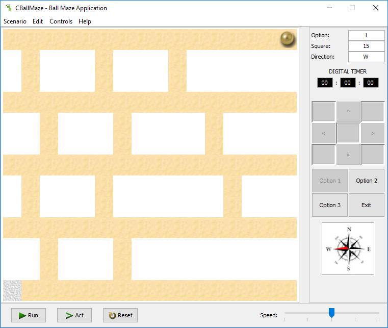

# BallMaze Assignment
Brief:
Using the Green Scenario included, produce a technical report and accompanying Java GUI application, simulating control of the ball moving (navigated) around the maze using left, right, up and down buttons/keys.

The problem is designed to be open within the rules below, to enable you to develop your solution(s) to the problem.

Rules Create a simulation of the ball moving around the pitch, where:
*	The ball must only travel when on the ‘sand’-coloured blocks otherwise it should not move.
*	The ball must move one whole ‘sand’-coloured blocks at a time every time a movement key is pressed - via a direction button (<, > v ^)) - (when movement is possible). 
*	Must use the scenario provided.
*	Must stop when it the ball reaches the grey block at the end of the maze.
*	The basic solution must be completed using the ‘act’ button (accessing the moveBall() method within the CBallMaze.class).
*	Whilst maintaining the features of the basic solution add the following
*	When there is a block below the block the ball is automatically go down. In other words if the ball can drop it ‘falls’ down until a white space is below it.
*	Add a sound effect when the ball drops.
*	The ball must not fall into the white spaces.

